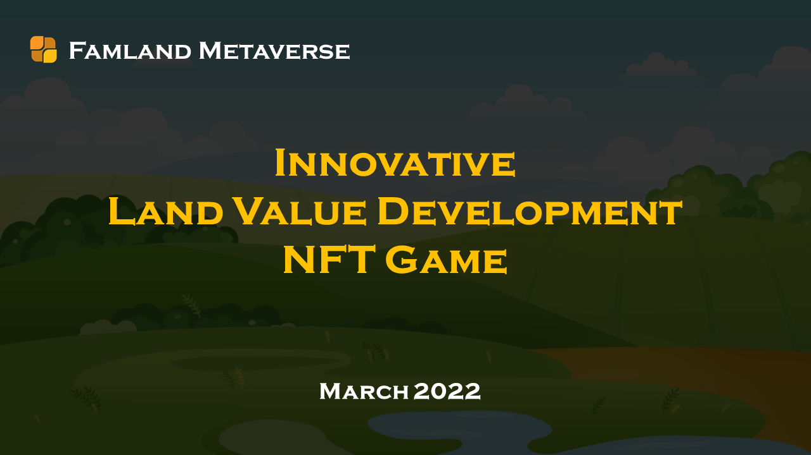

## Project Abstract
Famland Metaverse is an NFT value-cultivating Play to Earn game ecosystem that integrates various components including NFT, Game, and Defi. Any player only needs an EOS wallet address to create and generate Famland NFT. Players can pledge 100-500USDT of Metaverse home ownership Fund in Famland to continuously obtain YL farming income. By consuming YL, they can continuously nurture Famland's fertility and Share the value, and get a higher return.
The Famlands of countless homebuyers are connected to form a new continent of value in the Metaverse. This new continent, just like the earth on earth, can plant trees, build buildings, build shopping malls, build schools, build factories, develop commerce, develop economy, develop culture, develop art, and build a new human order and new civilization.
The game is based on the original intention of people-oriented design, does not rely on capital investment, pays attention to the value of time and wisdom invested by homebuyers in the game, and relies on the algorithm rules of NFT value development and value sharing to maximize the protection of each homebuyer's basic game in the game. Rights and fairness minimize the unfavorable factors that use capital to damage the healthy development of the game ecology.
Famland Metaverse is a completely community-based project. The founding team of the project has no pre-mining, no handling fee income, and no operating commission. All assets and income issued by the project are 100% returned to community home buyers.

## Community Contact

| Website     | URL                                                         |
| -------- | ------------------------------------------------------------ |
| Website  | [https://famland.world](https://famland.world)               |
| Telegram | [https://t.me/famland_eos](https://t.me/famland_eos)         |
| Twitter  | [https://twitter.com/famlandworld](https://twitter.com/famlandworld) |
| Facebook | [https://www.facebook.com/100061198864065](https://www.facebook.com/100061198864065) |
| Youtube  | [https://www.youtube.com/channel/UCxcjmaAU3KzRfa4xB7mbuEg](https://www.youtube.com/channel/UCxcjmaAU3KzRfa4xB7mbuEg) |
| Medium   | [https://medium.com/@yle.world](https://medium.com/@yle.world) |
| Discord  | [https://discord.gg/AaTXtuhDrb](https://discord.gg/AaTXtuhDrb) |

## Smart contract address

| Smart contract     | Address        |
| ------------------ | -------------- |
| YL/USDT Swap contract   | Contract address to be announced |
| YLE Farm contract       | Contract address to be announced |
| YL contract             | Contract address to be announced |
| Famland NFT contract    | Contract address to be announced |
| CryptoTree NFT contract | Contract address to be announced |
