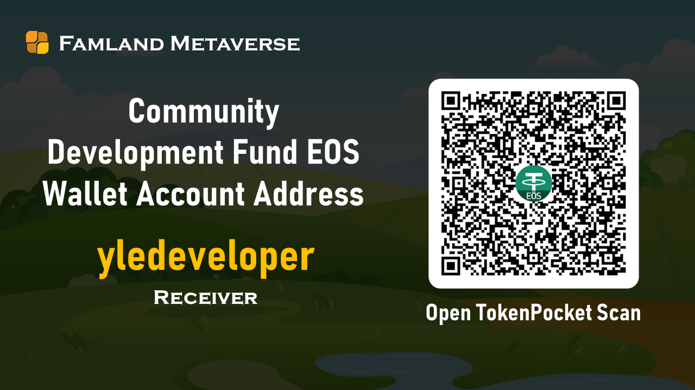

**Airdrop Amount: 200,000 YL**

**Event time: July 19, 2021 - the project is officially launched (expected in January 2022)**

A total of 400 market-making qualifications for Famland's original fields are open for subscription. The subscription fee for each original field market making qualification is 500USDT. There is no limit to the number of subscriptions for the same wallet address. All the subscribed funds are used for the pre-project development and smart contract audit expenses.

> **What is Famland's original field market making qualification?**
>
> Famland's original field market-making qualification is an early investment plan for the earliest players to participate in the project before the project is officially launched. Players who have obtained the qualification of original field market-making can preferentially enter the original field market-making channel for market making before the project is officially launched. When making the market, you must invest another 500USDT to complete the original field principal market making (the system automatically distributes 500YL, and the market making principal doubles), and enjoy the special benefit of at least 4 times the actual investment principal efficiency of the original field. At present, during the period of the original field market-making qualification subscription activity, you can also get the corresponding airdrop benefits according to the amount of subscription money.

> **Can the project obtain the qualification for making the original field market after the project is launched?**
>
> After the project is officially launched, players must complete the basic field market making before they can make a market in the original field. The entrance of the original field market making channel is only open for 72 hours, and a total of 600 original field market making places are open. Original field's market making requires luck. At this stage, Original field market making can only get YL rewards distributed by original field market making funds at a ratio of 1:1, and there are no other rewards.

Users must use the EOS wallet to pay USDT to the community fund wallet address to participate in the airdrop activity. The payment time is based on the UTC+8 time zone.

**Community Development Fund EOS wallet account address: yledeveloper**

**Transfer Memo Notes: original field**

**Subscription record on-chain query address**：[https://bloks.io/account/yledeveloper](https://bloks.io/account/yledeveloper)

> **Original field Market Making Whitelist Subscription Risk Warning**
>
> Subscribing for original field market-making whitelist qualification has certain risks. Once the USDT paid for the subscription is transferred to the development fund wallet, the funds will never be recovered regardless of the success or failure of the project.

## Subscribing to Original field Market Making Whitelist Eligibility Airdrop Rewards

| Cumulative subscription amount |      Amount of reward YL       | Reward the number of Cryptotree |
| :----------: | :-------------------: | :------------: |
|  1500 USDT   | 1:1 airdrop according to the accumulated subscription amount |       1        |
|  5000 USDT   | 1:1 airdrop according to the accumulated subscription amount |       5        |
|  10000 USDT  | 1:1 airdrop according to the accumulated subscription amount |       20       |
|  50000 USDT  | 1:1 airdrop according to the accumulated subscription amount |      200       |

> Illustrate

> 1. The above airdrop rewards of YL and CryptoTree will be transferred to the subscriber's wallet account within 3 days after the project is officially launched.

> 2. From July 19, 2021 to November 11, 2021, users who have participated in the subscription of Original field market making qualifications, if the accumulated subscription amount during the event period reaches the above standards, the community will reissue the corresponding rewards according to the above standards.

> 3. The above airdrop rewards will end when the project is officially launched or the airdrop quota is allocated.

## Airdrop reward distribution

|assets       | total amount | Assigned | remaining  |
| ---------- | ------ | ------ | ------ |
| YL         | 200000 | 94000  | 106000 |
| CryptoTree | 600    | 298    | 302    |

The cumulative number of subscriptions for Famland's original field market-making qualifications: 188, and the remaining 212.

Data statistics as of: November 11, 2021 12:00

  

## Past subscription records

**The first stage (2021.7.19-2021.7.29) subscription list:** 

https://docs.qq.com/sheet/DWmFkSVppWGtDdWRa?tab=BB08J2

The second stage (2021.9.10-2021.9.30) subscription list:

https://docs.qq.com/sheet/DWmFkSVppWGtDdWRa?tab=kgmo9f

The third stage (2021.10.1-2021.10.31) subscription list:

https://docs.qq.com/sheet/DWmFkSVppWGtDdWRa?tab=obch7l
