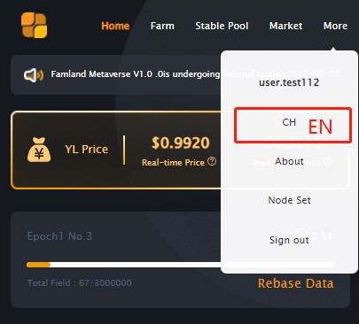
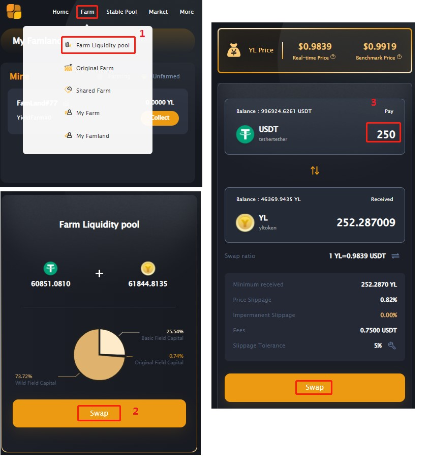
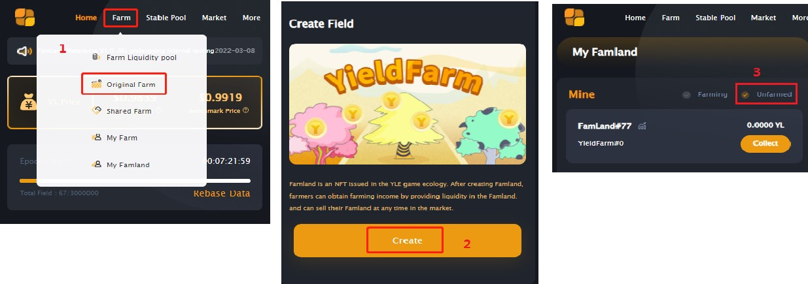
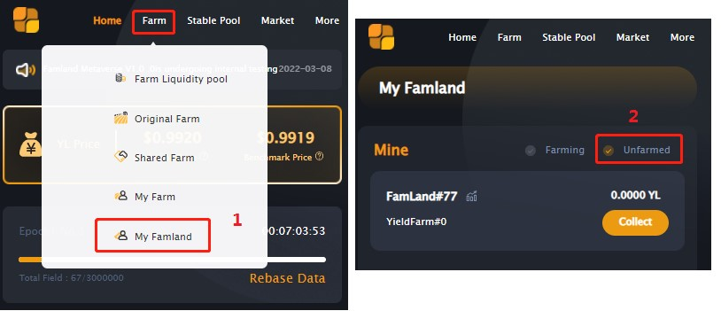
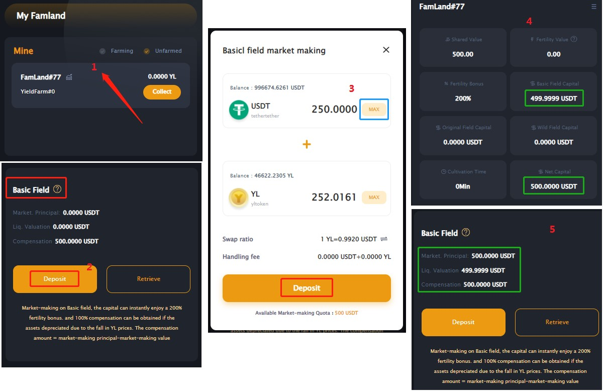
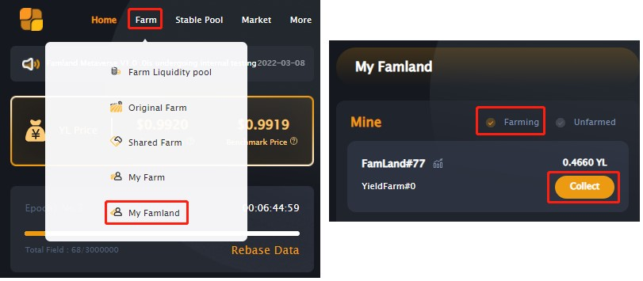
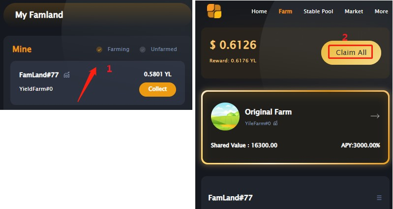
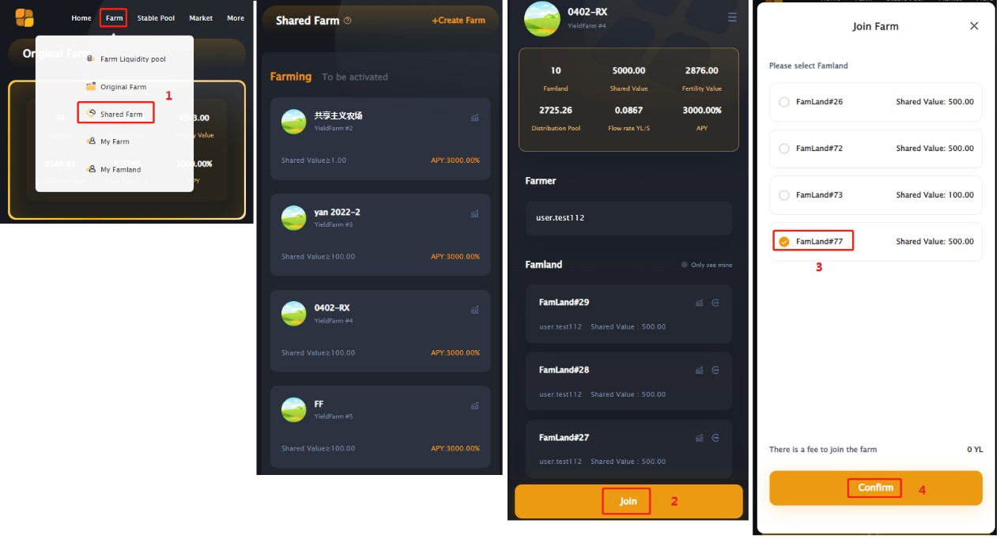

## 1. Preparation

1、After entering the DAPP, you can switch between Chinese and English in the "more" in the upper right corner of the interface;

2、Prepare YL. Convert the USDT you hold into YL through the SWAP function (Note: the range of the basic field market-making quota is: 50U/50YL~250U/250YL), make sure that you have 250USDT and the amount of YL equivalent to 250USDT in your wallet;

##  2. Market making in basic fields

1、To start farming Farland and generate income, it must to market-making the basic field in Farland. First you have to create a new famland.

> Note: The new famland created can also be found by the following path.

2、Start market making for basic fields. First, select the famland to be market-making, click "Deposit" in the Basic field, prepare to pledge your seed money, fill in the amount you want to pledge, and then confirm.

> Remarks: The minimum amount of USDT is 50 and the maximum amount is 250; it is strongly recommended that you choose MAX, because if you want to supplement the pledge, 100% of the principal of the second pledge will be paid as a handling fee.
After successful market making, you can view the properties of famland.

At this point, congratulations, you have successfully completed the basic field market making, and activated the generation of income.

## 3. Receiving income

At the beginning of market making in Famland's basic fields, farming income is activated. If you want to receive income, first find the Famland you want to receive income from, and click Collect;

You can also get it by entering the Famland.

## 4、join the shared farm.

All newly created and market-making Farlands are in Original Farm by default. You can also switch Farmland to other shared farms. It should be noted that the shared farm has corresponding admission requirements, and you must meet the corresponding requirements before you can join.

