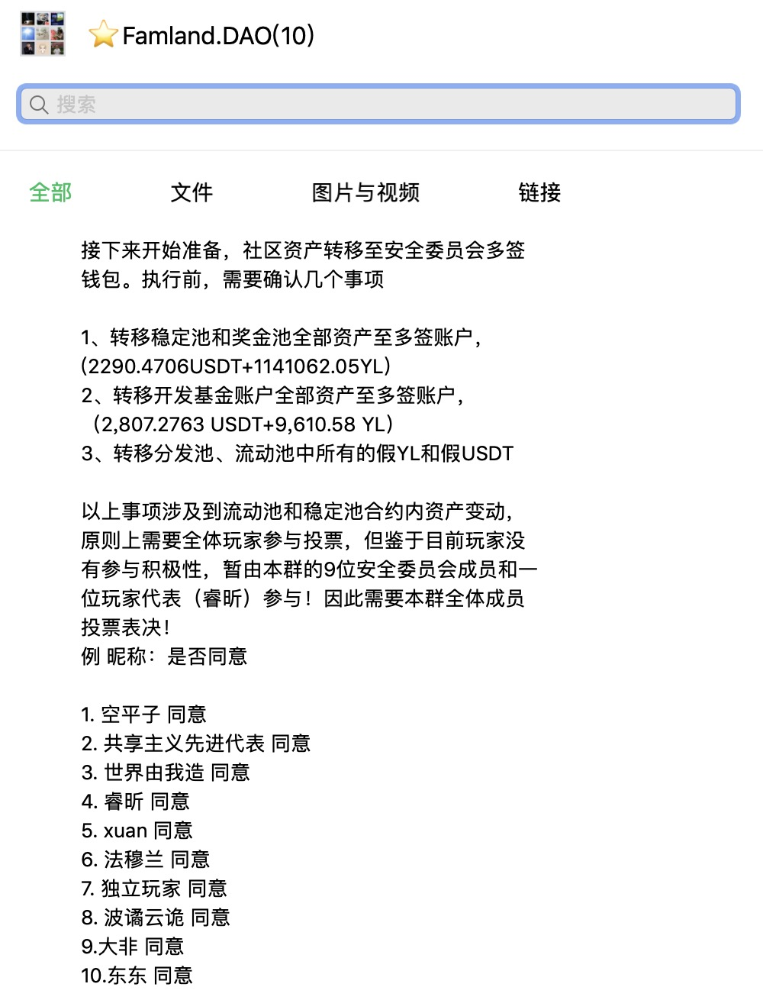
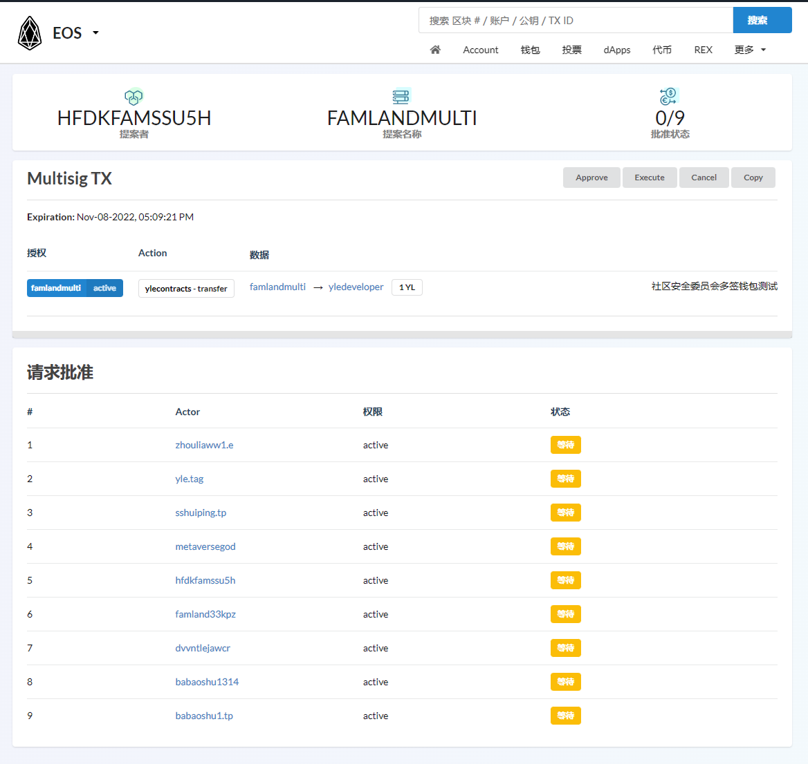
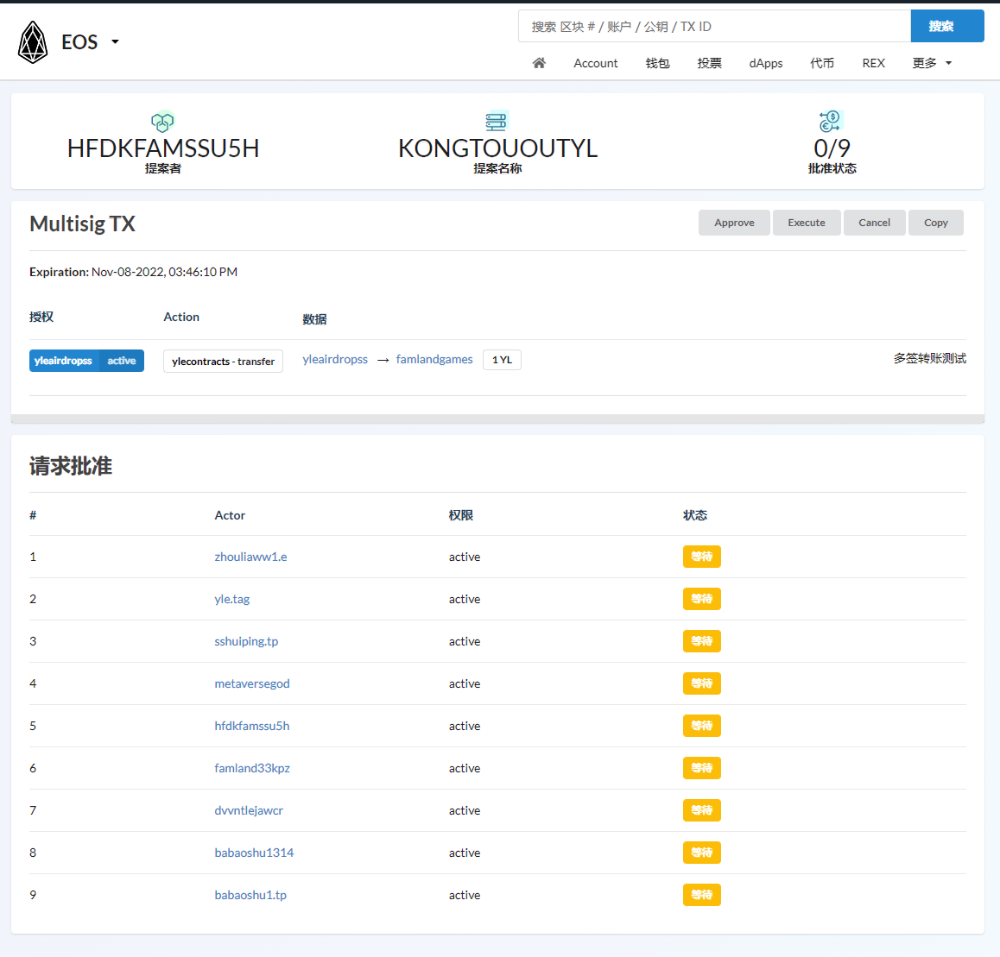

**成立FAMLAND.DAO社区自治安全委员会：**

造成本次黑客攻击事件的核心原因，是社区安全意识不足，智能合约部署及审计流程不严谨不规范，为根本解决此类问题，社区拟通过从社区主要核心玩家中进行招募选举，成立专门的安全委员会，专职负责社区的安全建设和合约部署更新等常规事宜的流程监督和管理，安全委员会组成成员接受全体社区成员的监督。

社区安全委员会的成员由 @盐之有理 具体负责招募，初期组成人员7-9人，于11月5日前组织社区全体玩家投票产生。委员会成立后，将公示安全委员会成员身份的钱包地址，并将其钱包地址加入到相关钱包的多签账户中。

**社区安全委员会的职能：**  
1、监管社区各合约账户变动情况，当流动池合约资产发生10%以上的资金变动，第一时间响应熔断机制，安全委员会成员在不变更合约业务规则的前提下，通过多签方式调整合约权限，临时终止/开启合约正常交易的执行；

2、参与社区专用钱包账户的多签出入金管理，包括社区开发基金账户、社区空投及运营账户等。社区核心合约内资金的变动（包括流动池、蓄水池、分发池、稳定池、奖金池、农场共享池等合约），须由社区安全委员会提请资金变动请求提案，由社区玩家投票，符合通过条件后，方可安排执行。

3、加强合约安全监管，规范合约上线部署流程，技术团队每次合约更新的新代码须由安全委员会提交审计公司初审，初审通过后，再进行正式链的部署，部署后的合约代码，需要审计公司再次复核。  

4、社区日常运营的讨论与执行。

**社区安全委员会的议事规则：**   
涉及社区安全的相关提案，安全委员会成员的有效投票数须达到全体成员2/3以上，方可执行。社区技术团队提供相应的技术支持和配合。  

***
**FAMLAND.DAO社区自治安全委员会成员报名记录：**  
[成立FAMLAND社区安全委员会 #155提案](https://github.com/famland/website/discussions/155)

**Famland.DAO社区核心资产账户：**  
空投账户：[yleairdropss](https://bloks.io/account/yleairdropss#keys)  
开发基金账户：[yledeveloper](https://bloks.io/account/yledeveloper#keys)  
市值管理账号：[famlandmulti](https://bloks.io/account/famlandmulti#keys)  

安全委员会已完成以上社区账户的的多签权限调整，点击对应账号可查看链上多签权限记录
***
经安全委员会商讨决定社区资产需要转移至对应的多签钱包，等待二次审计后，按照[重建社区信心，激励做市提案 #157](https://github.com/famland/website/discussions/157)执行

1、转移稳定池和奖金池全部资产至多签账户，(2290.4706USDT+1141062.05YL).  
2、转移开发基金账户全部资产至多签账户，（2,807.2763 USDT+9,610.58 YL).   
3、转移分发池、流动池中所有的假YL和假USDT.  

***
 
 
