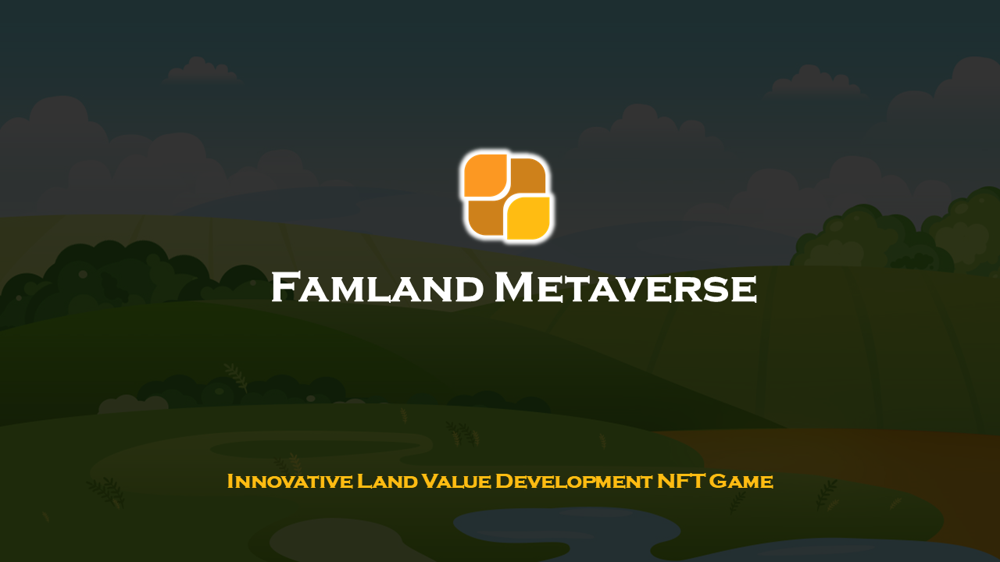

## 项目概况

随着科学技术的发展，人类史无前例的跨文明大迁徙已经开始，越来越多的人，已经将生活、工作的重心逐步转移到虚拟的数字世界中。现实世界的经济体系也在向新的虚拟数字世界经济体系转变。

基于我们对元宇宙世界热情和不断探索，作为承载全新数字经济体系重要的基础设施，我们将充分利用区块链技术的去信任机制和数据不可篡改的特性，打造一个可以在数字元宇宙私域领土上进行置业的Play-to-Earn生态系统。

#### 概述
Famland元宇宙，是一个集合包括NFT、Game、Defi多种组成要素的NFT价值养成型Play-to-Earn游戏生态。任何玩家，只需要一个EOS钱包地址，即可免费创建生成一个Famland NFT，每一个Famland NFT即是置业者在Famland元宇宙中创建的一块私域领土。

玩家在Famland中质押价值100-500USDT的元宇宙置业种子基金，即可源源不断获得耕种收益YL，通过消耗YL不断培育Famland的肥力和共享值，进而获得更高的收益回报。

无数用户的Famland连接起来，就构成了元宇宙中的价值新大陆YLE。这个新大陆，就像地球上的土地一样，可以在上面种树、盖楼房、盖商场、盖学校、盖工厂，可以发展商业、发展经济、发展文化、发展艺术，构建人类新秩序和新文明。

游戏本着以人为本的设计初心，不依赖资金投入、重视玩家在游戏中时间和智慧投入的价值，依托NFT价值养成和价值共享的算法规则，最大限度保障每名玩家在游戏中的基本权利和公平性，把利用资本损害游戏生态健康发展的不利因素降到最低。

Famland元宇宙是一个100%完全社区化的项目，项目所涉及的开发、运营、市场经费全部来自普通用户投资或捐助， 项目发行的所有资产和收益，100%全部回馈社区玩家。

#### 置业者的新世界
Famland与传统游戏的Play-to-Earn模式的显著区别在于，传统游戏的Play-to-Earn模式是一个0到1，再到无穷大的过程。这种模式和今天绝大多数现实世界项目的创业模式类似。

在Famland元宇宙中置业，无需从0到1，每一位置业者，只需要在Famland中投入100-500USDT的的种子置业资金，就可以开始将自己共享意识和其他置业者的共享意识进行融合，融合完成以后，1就产生了，无数个置业者的1，在所有置业者的共识作用下不断聚合起来，这就是1到无穷大的置业过程。

Famland元宇宙置业，是采用共建共享的模式，这样一种经济模型，最大的意义在于能让社区的每一位置业者能在Famland元宇宙中达成人人财富权的平等，不再会被资本或权势控制，只需要通过自身努力耕耘实现财务自由，最终实现人类社会的人人平等。这也将是每位置业者的权利、义务、使命和荣耀。

####  置业者的盈利方式

- 耕种Famland的收益

- 培育Famland NFT

- 持续采集Nephrite NFT

- 在市场上交易生态内的 NFT

- 质押YLS获得共享奖金分红

- 投资共享农场获得农场耕种收益分红

- 获得共享农场激励基金奖励

- 投资Famland原始田的空投奖励

- 社区置业者的空投奖励

- 敬请期待更多

#### 我们的任务和使命

- 帮助更多的人在Famland元宇宙中开拓一块真正属于自己的私域领土上置业，为所有置业者提供一个实现财务自由不可获缺的主要途径。
- 让所有置业者通过Famland共同构建Famland元宇宙的新大陆YLE生态，并让这个新的大陆呈现出无限价值和蓬勃生机，履行一生二、二生三、三生万物的元宇宙使命。
- 通过Famland元宇宙置业过程，实现人人财富权平等、打造一个人人享受公平正义的开放世界。
- 将Famland元宇宙项目打造并共享成一个更开放、更有效率、更容易达成共识的元宇宙NFT价值标准，团结全球开发者和用户，共建共享，造福全人类。

## 基本概念

**YL**

YL（Yield Land）是YLE生态中新型的算法稳定积分，是承载YLE生态中所有数字资产价值的最基本的单位和交易体。YL的发行和YLE生态内新增的Famland经济价值挂钩。人们在YLE的农场中耕种Famland可以持续永久获得YL收益。

**Famland NFT**

Famland NFT是人们在元宇宙中进行置业，实现Play-to-Earn的载体，Famland就类似是自己的私人农田，置业者在Famland上投入种子置业资金后，即可源源不断产出YL收益。培植Famland的核心是提升Famland的肥力值和共享值。

**YLE生态**

无数置业者创建的Famland NFT共同构建成了YL生态（YLE，Yield Land Ecology），YLE是Famland元宇宙的新大陆，Famland以及其它各类NFT，将在这里不断生成、发育、迁徙、变化和融合。而这个变化和融合的过程，就是YLE的构建过程。YLE将承载一个全新的人类社会和人类文明。

**原生农场**

原生农场是YLE生态内的公共农场，所有置业者新创建的Famland，默认情况下都从属于原生农场下耕种，并按照该农场的APY收益率获得耕种收益。如果置业者将Famland加入共享农场后，也将从原来从属的农场中退出。

**共享农场**

YLE生态除了公共的原生农场外，置业者们可以自由组合自己的Famland形成新的共享农场，只要已经在基本田存入种子置业基金的Famland数量达到30，即可创建新的共享农场。不同的农场，享有不同的APY收益。

**Famland的基本田**

元宇宙中的Famland耕种，核心主要体现在基本田的耕种，基本田耕种需要置业者用心经营和配置，它决定着置业者个人以及这块Famland未来的价值、荣誉和地位。置业者只有满足优先在基本田存入种子置业基金，才能产出YL收益。原始田和野田无须太多操心，只需按需投资就行。

**Famland基本田做市资金赔付**

置业者存入Famland基本田的本金，如果因YL价格降低，导致做市资产亏损时，在取回全部基本田做市资产时，可以100%获得亏损额度的赔付。所以Famland的置业者，无需担心基本田耕种的风险。

**USDT/YL LP 农场池**

置业者们在Famland上存入的种子置业基金后，所有存入的资金将自动进入到USDT/YL LP 农场池中。只要你有USDT或者YL，就可以通过创建一个新的FamlandNFT，并在其基本田内同时质押USDT和YL，获得耕种收益YL。

**YL的价格稳定机制**

YL是YLE生态中的算法稳定积分，其价值的相对稳定性，是通过YLE内YL价格稳定算法机制来实现。这种算法机制会在一个时间段内，对交易市场过热的买入或抛售行情起到一定拟制作用，同时当YL价格低于基准价时间段，通过基金奖金激励YL的购买者，使得YL的价格处于一个相对稳定的价格区间范围内。

YL的价格稳定机制主要由以下三个部分组成：1、SWAP交易无常滑点机制；2、稳定基金池工作机制；3、稳定奖金池工作机制；

**SWAP交易无常滑点**

无常滑点，是在SWAP交易过程中，如果YL的交易价格偏离正常浮动区间时，产生的一种不确定的交易滑点值，交易价格偏离基准价格越远，无常滑点可能产生的不确定值就越高，无常滑点手续费就越高。这种算法机制会在一个时间段内，对交易市场过热的买入或集中抛售行为起到拟制作用。

**YLE农场稳定池**

YLE农场稳定池分为稳定基金池和稳定奖金池。其中稳定基金池的作用是其作用是使用稳定基金池内的资金，通过自动化SWAP交易平衡和稳定YL的市场交易价格。

**YLE农场基金池**

稳定奖金池的作用是当YL的价格低于基准价格时，激励这个期间YL的购买者，从而保障YL的价格回升到YL正常的稳定基准价区间内。

**Famland的肥力值**

肥力值是YLE生态中重要关键性价值属性。对于整个YLE生态而言，Famland肥力值的增量决定每个耕种周期内新增发的YL向所在农场分发池划转YL的流速，Famland的肥力值增量越多，从YLE蓄水池流入各个农场分发池的YL流速将越快，农场产出的YL越高。

**Famland加持NFT**

根据Famland肥力值的计算规则，要想提升肥力值，由于受到做市资金的额度限制，只能通过延长基本田的耕种时长达到目的。而Famland如果一旦通过NFT进行加持操作，就可激活NFT肥力加成系数的永久性提升的通道。

**CryptoTree NFT**

CryptoTree是第一代可用于对Famland加持的NFT，加持成功后，Famland的肥力加成系数可立即获得提升，未来，哪些NFT可以为Famland进行加持提升，肥力加成提升多少数额，将有社区投票决定。

**Nephrite NFT**

和田玉是YLE中一种产自Famland并可循环使用的NFT，其主要作用是合并两个或多个Famland时，消耗Nephrite NFT，提高合并的成功率和合田后Famland的共享值。

**元宇宙NFT价值标准**

如同现实世界中的山地、沙漠、草原、耕地虽然都存在与地表，但其价值对于人类来说是不相同的。在元宇宙的世界中更是如此，任何人都可以写一串代码就宣称，它是孕育元宇宙各种生态的土壤，但是，这块土壤有没有价值，这块土壤所孕育出的数字经济载体是否有价值，则需要一个开放的、更有效率、更容易达成共识的标准来衡量。Famland元宇宙项目是在通过Famland NFT和YL构建一个全新的YLE生态，运作去创建一个数字元宇宙、精神家园的底层价值的技术和逻辑标准。该标准将开源，团结所有开发者和用户，共同维护升级元宇宙NFT价值标准。

## 游戏玩法及规则

### 游戏的可持续性发展

Famland的生态的算法稳定积分YL，是承载生态中所有数字资产价值的最基本的单位和交易体。是Famland元宇宙的经济价值稳定的基础。而Famland NFT是人们在元宇宙中置业，实现可持续性Play-to-Earn的重要载体，同时Famland NFT作为社区 DAO投票权的基础，也可以用于挖矿。因此，Famland将在市场上将获得更高的经济价值。

如果你是新手，你可以通过以下方式参与YLE生态的经济系统赚钱。

1、耕种Famland赚钱

2、培植Famland赚钱

3、质押YLS赚钱。

---

### Famland耕种收益

置业者创建Famland NFT后，通过在Famland的基本田存入USDT和YL种子置业资金，获得耕种收益。当然置业者也可以选择在Famland原始田和野田中存入资产。

**耕种收益的计算规则：**

**耕种收益=当前收益时长（分种）×（（基本田做市资金价值+原始田做市资金价值）×肥力值加成系数+野田做市资金价值）× 收取收益时农场实时的年化APY/525600**

当前收益时长=上一次收益时间 或 首次做市起点时间 至 收取收益时间 的总时长（分钟）

做市资金价值=存入的USDT数量+存入的YL数量*YL实时价格

根据以上算法规则可知，置业者如果希望获得更高的耕种收益，收取时刻的农场年化APY是一个重要的指标，APY的数值变化将会影响本次收益期内待收取YL的实际数量。

Famland产出的YL，如果大家暂不去收取，而是继续暂存在农场分发池内，分发池内所积累的余额将越来越多，随后一段时间内，农场的APY将会逐步提高，这样农场内所有置业者所产出的YL数量也会更多一些。**Famland产出的YL留置在农场分发池的时间越长，置业者的收益越高。**

#### 基本田做市

基本田初次投入资金价值范围设定在100-500 USDT之间，存入成功后，基本田肥力值加成系数立即增加1变为2。根据以上耕种收益的计算公式得知，置业者投入1份的资金，相当于获得了按基本田双份资金价值计算耕种收益。

置业者在基本田地块投入做市资金后，如果要新增资金或取回基本田的资金均需要支付手续费。费率标准如下：

1、取回基本田资金，按照取回的资金数额，支付1%手续费。每次不论做市资金取回多少，Famland耕种时长将清零重新开始累积计算。

2、基本田二次做市或增加基本田资金，将按照增加的资金数额，支付100%的手续费。但增加后的资金的总额价值不超过500USDT。

**基本田做市资金损失100%赔付机制**

本着以人为本的初衷，YLE对置业者在基本田做市资金的损失采取全额赔付的机制，最高赔付额度为500USDT。也就是说因YL价格下降，造成基本田做市资金出现损失，损失的资金将由YLE的100%赔付，当用户全部取回基本田做市资金时，赔付资金按照亏损的金额以YL的实时价格计算成等价值的YL数额，从稳定基金池内支付。

赔付机制的目的就是希望用户安心耕种基本田，即便出现价格大幅降低，也无须担心基本田做市资金的风险。同时YLE生态内所有用户的基本田的资金，也为整个YLE的资金池交易提供充足的流动性保障。

玩家在原始田和野田做市资金因价格波动造成做市损失，无赔付。

**基本田做市赔付产生的时机**

用户取回基本田全部做市本金时，触发赔付机制。

**赔付额度**

基本田的赔付额度=基本田存入的本金价值-当前实时做市价值-每次取回的做市资金价值-每次提取的收益价值。赔付额度最高500U，最低不限，赔付额度低于0时，界面始终显示0。

**赔付的资产、数量和资金来源**

用户取回全部做市资产后，除了从流动池中取回相应数量的U+YL外，触发赔付机制。赔付是按照赔付资金的U价值根据触发机制时的YL实时交易价格，换算成相应数量的YL，从稳定池支付给用户。稳定池如果YL余额不足，赔付将终止。

#### 原始田做市

Famland的原始田地块是具有一定风险耕种收益的土地，但也是收益最高的地块，用户只有取得原始田做市资格白名单后才能在原始田中做市。（如何获得Famland原始田做市资格白名单，可查看社区最新活动）

 一块原始田用户最多可投入500USDT，系统将按照原始田投入的USDT的数量赠送同等价值数量的YL，系统将用户投入的USDT和系统赠送的YL一同投入到资金池做市。

原始田做市资金一旦投入，Famland的肥力值加成系数立即增加1，变为2（原始田和基本田奖励共享肥力加成系数增加额度，两个地块同时做市时，肥力加成系数只增加1）。也意味着，用户在原始田投入的500USDT，可以直接获得相当于2000USDT做市资金价值，如果用户的Famland栽种了加密树NFT，肥力值加成系数还可再增加1，变为3。那么用户实际投入的500USDT，相当于获得了相当于6倍本金的做市价值，也就是当计算耕种收益时，是按照3000USDT的做市资金来计算耕种收益。

**投资风险警示：**

**用户在原始田地块投入的做市资金，一旦投入，无论项目成败，永久不能取回。**

#### 野田做市

野田地块初始做市价值最高不超过1万USDT，做市额度上限可随着肥力值提升而提升，野田做市没有肥力加成，也没有本金赔付保障。

野田做市额度可按照500USDT为单位进行提升，首次提升500USDT的做市额度，肥力值须提升至20000，以后再次提升，肥力值再之前提升值基础值增加3‰。

野田地块做市资金可随时抽出，抽出做市资金后也不影响Famland耕种时长。

---

### 培植Famland

Famland的培植，主要目标是提升Famland的肥力值。肥力值提升主要分为两个方向。一是累积提升、二是加持提升。

#### 累积提升

Famland累积提升，取决于Famland所存入基本田种子基金做市的耕种时长和基本田做市资金数额。

具体算法如下：

**肥力值=耕种时长×3%×（基本田和原始田做市资金价值×3%×加成系数+净投入资产×0.03%）**

加成系数：默认为1，基本田存入资金后，加成系数将提升1，Famland加持NFT后累积肥力值将根据肥力值增长量按规则转成一定的加成系数数额。

**耕种时长**
用户在Famland基本田地块做市成功后，耕种时长开始按分累计，在基本田取回做市资金，不论取回多少，耕种时长清零重新计算。肥力值受耕种时长的影响也会重新开始计算。在基本田增加做市资金或在野田取回做市资金不影响耕种时长。

#### 加持提升

元宇宙是人类精神文明的世界，在现实世界中耕种土地，人们需要付出的是体力劳动，而在元宇宙的Famland上耕种，人们需要付出的是脑力劳动。

所以，在Famlan元宇宙中，所有凝聚人类精神、意识、文化、艺术等元素的NFT都可以为Famland进行肥力加持。包括但不限于加密树、加密农作物、加密房产、加密动植物等等。

Famland的肥力加持提升，取决于所加持NFT的属性。只要将NFT对Famland完成加持操作，就能立即获得对加成系数的提升，CryptoTree是YLE中第一代可用于对Famland加持的NFT，加持成功后加成系数可立即提升1，未来，哪些NFT可以为Famland进行加持提升，肥力加成提升多少数额，将有社区投票决定。

同时Famland加持NFT后，Famland将激活肥力值增量转化提升加成系数的通道。

Famland加持NFT后的肥力值转化加成系数规则：

Famland加持YLE生态内的CryptoTree NFT后，肥力加成可以按照0.001为单位进行提升，首次肥力加成提升0.001，肥力值须提升20000，肥力加成再次提升0.001，需提升的肥力值在之前的提升的基础值上提升3‰。

由此可见，Famland中，Famland的耕种时长越长、投入资金越大、肥力值越高、加持NFT后，进而转化的加成系数越多，耕种收益越高。

---

### 打造共享农场

置业者初始创建的Famland是默认是在YLE生态内的公共原生农场内进行耕种的，由于公共农场置业者的共识程度不一，挖提卖的现象将会很普遍，这种结果会导致共识度高的置业者和共识度低的置业者，所付出的价值共享程度不一而共享同一个APY收益回报，导致耕种收益分配不公的现象。

因此，YLE生态除了公共的原生农场外，置业者们可以自由组合自己的Famland形成新的共享农场，只要已经在基本田存入种子置业基金的Famland数量达到30，即可创建新的共享农场。这样YLE生态为共识度高的置业者们提供了一个凝聚共识的机制，通过创建共享农场，享有不同的APY收益，达到Famalnd共置的目的。

共享农场，是Famland元宇宙价值共享的核心。价值共享越多的人，在后期获得的回报越来越多，而价值共享越少的人，在后期获得的收益也会越来越少。这就是共享农场设计和建设的基本原理。

共享农场的APY收益率高低，取决于该农场的分流指数，而该农场的分流指数又由该农场的平均共享值决定。

共享农场是在原生农场之外，又增加了一个与它相平行的农场。同样道理，平行的新农场，也有自己的分发池。 这时候，YLE蓄水池中的YL，将根据每个农场（含原生农场和共享农场）的分流指数占比，分别流向各个农场的分发池中。

按照分流指数的算法规则，共享值越高的分发池，从蓄水池流入到分发池的流速越快。这就意味着，总分池流向不同共享农场的的流速，也是不一样的。

共享值是衡量Famland价值共享大小的重要指标，共享值越高，代表对YLE生态的贡献越大，反之，贡献越小。由此，为了激励用户参与YLE生态共享经济建设，YLE生态内的Famland可以脱离原生农场，自由组建新的共享农场参与耕种。同样的肥力值，共享值高的农场将比共享值低的农场获得更高的APY收益回报。

#### 创建共享农场 

创建农场需要支付120YL，共享农场创建后，创建人即为农场主，农场状态为筹备中的状态。此时农场还不能正常工作，农场内的Famland也没有耕种收益。农场主还需要邀约其他Famland加入农场，待参与邀约的已在基本田做市的Famland NFT达到30个后，农场主可以正式激活共享农场。激活成功后，共享农场的状态变更为正常状态。

创建农场支付的费用，60%进入YLE农场共享基金池，20%进入储备基金池，20%进入稳定池。

#### 邀请Famland加入农场 

邀请Famland加入共享农场有以下两种方式：

> **发布邀约广告** 邀约广告发布成功后，邀约订单将在邀约时效期限内，出现在前台界面，在符合邀约条件的要求下，其他用户的Famland如果符合准入条件可直接加入农场，无须支付任何费用，也无须该农场主批准。
>
> 首次发布邀约广告费用标准： 1个月600YL，3个月1600YL，6个月3000YL，12个月5600YL
>
> 再次发布邀约广告，广告费用在以上价格标准上翻倍。

> **通过邀请链接私下邀请** 农场创建后，系统默认给农场主生成好了邀约链接地址。农场主可根据需要调整私人邀约内容。私人邀约地址长期有效。

农场主发起邀约广告支付的费用以及用户Famland加入农场所支付的费用，60%进入YLE农场共享基金池，20%进入储备基金池，20%进入稳定池。

#### 退出农场 

用户Famland加入农场后，如果希望退出农场，只需要支付120YL可退出该共享农场，其中60YL支付给农场主，另外60YL中的60%进入YLE农场共享基金池，20%进入储备基金池，20%进入稳定池。

农场主也可以直接移除成员Famland，农场主支付120YL可移除共享农场中的成员，60YL支付给离场成员，另外60YL中的60%进入YLE农场共享基金池，20%进入储备基金池，20%进入稳定池。

农场创建成功后，农场主主动移除或农场成员自行退出，农场Famland数量即便低于30个，农场成员基本田提取做市资金，低于500U也不受影响农场正常工作。

---

### Famland共置

Famland共置的目标是提升Famland共享值，共享值的价值并不作用于Famland本身，而是作用在Famland所在的农场，提升的是所在农场的YL产量。农场的共享值越高、贡献共享值的Famland越多、产出的YL数量越多，农场的价值越大。

**共享值**

置业者在Famland基本田存入资产后，即可获得Famland的共享值。Famland默认的共享值最高不超过500，共享值将作用于所在农场，农场的共享值越高，农场获得的分流指数越多，流入农场分发池的YL越多，农场所产出的YL越多，置业者耕种收益的年化APY越高。

提升共享值有以下2种方式

#### 01 做市资金额度转化为共享值

**共享金额度**

共享金额度可以转化为共享值。玩家在名下所有Famland中每投入价值1USDT的做市资金，玩家累计的共享金额额度就增加1USDT，而从名下所有Famland中每提取价值1USDT的做市资金，共享金额额度就减少1USDT。置业者累计的共享金额度余额，在共享值限额的范围内，可按照1USDT的共享金额度转化1个单位的共享值。

**共享值限额**

共享值限额，是指Famland共享值每个周期阶段性的上限额度，由用户在该Famland基本田收取YL数量决定，置业者每从Famland基本田收取价值1USDT的YL，共享值限额可提升1，这个限额决定着Famland的在当前Famland最高共享值上限。

#### 02 Famland合并

Famland合并是指将自己钱包名下多个基本田做市本金价值达到500USDT的Famland进行合并，从而使合并后的Famland获得更高共享值的一种玩法。

---

### 合并Famland

####  合并要求

- 参与合并的Famland，暂不支持已在原始田和野田做市的Famland。

- 参与合并的Famland，Famland基本田地块做市本金价值必须达到500USDT。

- 每次合并Famland必须使用1个Nephrite NFT（和田玉），并支付合田手续费。

#### Famland合并规则

| 合并方式 |   使用和田玉    | 成功率 | 合并后的共享值 |
| :------: | :-------------: | :----: | :------------: |
|  2 in 1  |    gray jade    |  30%   |      65%       |
|  2 in 1  |   yellow jade   |  45%   |      70%       |
|  3 in 1  |   yellow jade   |  30%   |      55%       |
|  2 in 1  |   green jade    |  60%   |      75%       |
|  3 in 1  |   green jade    |  45%   |      60%       |
|  3 in 2  |   green jade    |  30%   |     50%*2      |
|  2 in 1  |   white jade    |  75%   |      80%       |
|  3 in 1  |   white jade    |  60%   |      65%       |
|  3 in 2  |   white jade    |  45%   |     55%*2      |
|  2 in 1  | mutton-fat jade |  90%   |      85%       |
|  3 in 1  | mutton-fat jade |  75%   |      70%       |
|  3 in 2  | mutton-fat jade |  60%   |     60%*2      |
|  5 in 3  | mutton-fat jade |  30%   |     45%*3      |

合并共享值是指最终合并后的Famland共享值是将多块Famland的共享值，合并结束后，最终得到的Famland相加后再乘以相应的系数。

#### 合并手续费

每次合田收取30YL，60%进入YLE农场共享基金池，20%进入储备基金，20%进入稳定池。

#### Famland合并结果

- 不论合并成功还是失败，合田所使用的和田玉NFT将收回至YLE农场共享基金池中，继续重新被采集分配。
- 合并成功后，将根据合田规则生成相应数量的Famland，每个Famland的基本田都将自动存入500U做市资金，共享值也按规则更新为最新数值。
- 被合并掉的Famland基本田做市资金将全部转入YLE农场共享基金，被合并的Famland将被销毁。

---

###  Nephrite的采集

#### 采集要求

基本田做市满500USDT的Famland，每个rebase周期会增加一次和田玉原石采集机会，错过采集机会，该采集机会将失效。

#### 采集费用

第一个耕种周期，采集费30YL，以后，每个rebase周期采集费在上一个rebase周期基础上提升0.1YL。
采集费用，60%进入YLE农场共享基金池，20%进入YLE储备基金池，20%进入YLE稳定池。
租赁人代农场主采集和田玉的费用，从Famland所在农场主基金中支付。

#### 采集规则

以下为每个耕种周期所有符合条件玩家采集次数对应可以采集的和田玉的比例。

| 采集次数 |                        采集和田玉占比                        |
| :------: | :----------------------------------------------------------: |
|   0-4    |                        gray jade 100%                        |
|   5-49   |                gray jade 80%, yellow jade 20%                |
|  50-499  |        gray jade 80%, yellow jade 18%, green jade 2%         |
| 500-4999 | gray jade 80%, yellow jade 18%, green jade 1.8%, white jade 0.2% |
|  ≥5000   | gray jade 80%, yellow jade 18%, green jade 1.8%, white jade 0.18%, mutton-fat jade 0.02% |

### Famland租赁
**出租Famland**

只有共享农场的农场主可以发起基本田租赁合同，有效租赁期间，Famland基本田部分的耕种收益，承租人和Famland主按租赁合同的分成比例分账。该Famland的原始田、野田的耕种收益仍然归农田主。

**租赁合约内容**

租赁合约将对Famland的租赁期限、收益分成比例、收益冻结比例、和田玉采集奖励规则、租赁合同终止条件及其他内容进行约定。
农场主和租户一旦确定租赁合约，在租赁合约到期前，合同内容无法修改。同一块田发起租赁合约后，无法再次发起租赁合约，必须等到租赁期结束后才能再次发起租赁。

**租赁合约发起费用**

农场主生成租赁合同时，将按照出租Famland的数量支付手续费，费用标准为：支付30YL/Famland，60%进入YLE农场共享基金池，20%进入储备基金池，20%进入稳定池。

---

## SWAP价格稳定机制

### 无常滑点保护机制

**无常滑点**

无常滑点，是在YLE内 USDT/YL LP 农场池的SWAP交易过程中，如果YL的实时交易价格偏离基准价（±0.02USDT含）时，产生的一种不确定的交易滑点值，交易价格偏离基准价格越远，无常滑点可能产生的不确定值就越高，无常滑点手续费就越高。

> 例如，当YL当前基准价为1.00USDT，YL实时交易价格为1.02USDT时，买方的正常交易滑点为0.03%。而无常滑点显示为0.1%-1%。可当交易价格为1.05USDT时，正常交易滑点依然是0.03%，而无常滑点显示为0.4%-4%。也就是说，此时交易，产生的最低总滑点可能是0.43%，而最高滑点将能达到4.03%。如果价格涨到1.06USDT，最高总滑点可能达到8.03%。以此类推。

**基准价**

基准价是SWAP无常滑点机制和稳定池运作的参考指标。从第1纪元第1个耕种周期开始，YL的初始基准价为1USDT，下一个耕种周期将按照上一个周期的YL交易的的中间价作为基准价。

>例如：第一个周期YL的市场交易价格波动在1.00-1.06USDT之间，交易中间价为1.03USDT，那么，下一个耕种周期的YL的基准价就是1.03USDT。

**无常滑点手续费承担者**

当YL交易价格相对基准价偏高0.02USDT及以上时，买方在交易时承担无常滑点手续费，卖方交易不受影响；反之，当YL交易价格相对基准价偏低0.02USDT及以下时，卖方在交易时承担无常滑点手续费，买方交易不受影响。

**无常滑点值算法规则**

当无常滑点机制启动时，无常滑点值从0.1%启动，价格偏离每增加0.01USDT，无常滑点都将在前一个无常滑点基础上翻倍，无常滑点值最高不超过100%。

### SWAP稳定池基金池

**稳定基金池自动交易机制**

YLE内设立了稳定基金池，其作用是使用稳定基金池内的资金，通过自动化SWAP交易平衡和稳定YL的市场交易价格。

当YL的价格在基准价格区间（±0.02USDT）内，稳定基金池不作为。

当YL价格发生偏离时，稳定基金池开始启动，先动用基金池内被交易TOKEN 0.1%的资金，优先成交偏离价订单。成交完，如果稳定基金池相应的资金量不足以完全成交，不足的部分再从农场资金池的Swap交易中获得。交易价格每偏离加大0.01，基金池动用的总资金在上一次的资金数额上翻倍。

比如，当YL价格涨到1.02USDT时，稳定基金池按照当时订单价格，优先出售池中0.1%的YL。价格涨到1.03USDT时，优先出售池中0.2%的YL。1.04USDT时，优先出售0.4%YL。价格每涨0.1%，稳定基金优先出售比例翻倍。

**稳定基金池的资金来源**

1. YLS稳定共享积分拍卖收入的80%
2. YLE生态内交易手续费的80%
3. 无常滑点交易手续费的80%
4. 蓄水池按用户耕种收益的4%划拨
5. 基本田调整质押资金手续费的80%

### SWAP稳定池奖金池

**稳定奖金池激励机制**

稳定奖金池的作用是当YL的价格低于基准价格时，激励这个期间YL的购买者，从而保障YL的价格回升到YL正常的基准价区间内。

**稳定奖金池的资金来源** 

1. YLS稳定共享积分拍卖收入的18%
2. YLE生态内交易手续费的20%
3. 无常滑点交易手续费的20% 
4. 蓄水池按用户耕种收益的1%划拨
5. 基本田调整质押资金手续费的20%

每个周期，稳定奖金池会将总资金的20%作为奖金进行分配，18%分配给常规奖金和随机奖金，2%分配给共享奖金。

稳定奖金池分为常规奖金和随机奖金两种激励方式。两种奖金的初始份额比例为1:1。

当YL价格下降到基准价格区间最低值以下时，在农场SWAP资金池内使用USDT兑换YL，必然可以获得常规奖金奖励，同时还有可能获得随机奖金奖励。

**常规奖金奖励规则**

常规奖金=用户购买YL支付的USDT×（当前周期常规奖金池资金余额/（上一个周期YL交易额×3））

例如，这个周期激励库的奖金额为3万USDT。上个周期的交易总额为1000万USDT。3倍就是3000万USDT。那么这时候，买方每交易1000USDT，就可以获得1USDT的常规奖金。

如果该周期内YL的购买资金过大，超过了上一个周期交易额的3倍，将按比例缩减随机奖金的份额，以确保常规奖金的分配。

**常规奖金结算：**

每个耕种周期的常规奖金都在该周期结束后，下一个耕种周期内手动进行结算，超过结算周期后将无法进行结算。

每个周期常规奖金未分配完的部分以及未结算的部分，将累计到下一个周期的常规奖金池中。

**随机奖金奖励规则：**

当用户进行上一个周期常规奖金结算时，将有一次抽取随机奖励的机会。

每个周期将会将当前周期随机奖金总额划分若干等分。其中特等奖1个，奖金占15%；1等奖3个，奖金占15%；2等奖9个，奖金占15%，3等奖30个，奖金占15%，激励奖300个，奖金占40%。

每个周期未发放完的的随机奖金，将累计到下一个周期的随机奖金池中。

## 游戏激励

### 共享农场排名奖励

YLE 共享农场设立了相应的激励机制，并专门设置了用于分配激励奖金的农场共享基金池。通过激励系统，增加YLE的博弈性、娱乐性和刺激性。让参与农场建设的用户在YLE World中能享受到更多的乐趣和收益回报。

**YLE共享基金池资金来源**

农场建设费类：包括Famland邀约广告费，进场费、离场费等等；

农场手续费类：包括Famland租赁手续费、合田手续费等等；

农场合田费类：包括和田玉采集费。

YLE共享农场激励系统分为三个部分。

- 农场共享值排名奖励（奖金占比40%）

- 和田玉原石采集奖励（奖金占比30%）

- 合田奖励（奖金占比30%）

**农场共享值排名奖励**

**农场共享值排名（奖金占比：22%）**

排名奖励给每个Rebase周期农场共享值排名前10名的农场主。

| 排名     | 奖励数额 |
| -------- | -------- |
| 第1名    | 7%       |
| 第2名    | 5%       |
| 第3名    | 3%       |
| 第4-10名 | 1%       |

**Famland共享值平均值排名（奖金占比：26%）**

排名奖励给每个Rebase周期农场共享值平均值排名前10的农场主。

| 排名       | 奖励数额 |
| ---------- | -------- |
| 第1名      | 5%       |
| 第2名      | 3%       |
| 第3名      | 2%       |
| 第4-10名   | 1%       |
| 第11-20名  | 0.5%     |
| 第21-50名  | 0.1%     |
| 第51-100名 | 0.02%    |

**新人农田排名奖励（奖金占比：30%）**

排名奖励给每个Rebase周期共享值排名前50的新人农田，农田加入农场时长不超过30天。

| 排名      | 奖励数额 |
| --------- | -------- |
| 第1名     | 5%       |
| 第2名     | 2%       |
| 第3名     | 1%       |
| 第4-10名  | 0.8%     |
| 第11-20名 | 0.2%     |
| 第21-50名 | 0.1%     |

**和田玉原石采集奖励**

每个Rebase周期符合资格的用户，按中奖人数均分该奖项的奖金，如果只有1个人独中奖项，可以分掉该奖项全部奖金。采集次数越多可获得的中奖奖项越多，例如：连续采集100次以上，可以同时获得ABCDE五个奖项的奖金。

| 等级 | 连续采集次数 | 奖金占比 | 数量 |
| ---- | ------------ | -------- | ---- |
| A    | 100          | 20%      | 2    |
| B    | 60           | 20%      | 4    |
| C    | 30           | 20%      | 6    |
| D    | 20           | 20%      | 8    |
| E    | 10           | 20%      | 10   |

**农田合田奖励**

每个Rebase周期用户对基本田合田操作均可以有机会获得奖励，不论是否满额做市，中奖几率按照合田手续费来计算比例。

| 等级 | 奖金占比 | 数量 | 中奖几率 |
| ---- | -------- | ---- | -------- |
| A    | 20%      | 1    | 0.01%    |
| B    | 10%      | 1    | 0.1%     |
| C    | 5%       | 2    | 1%       |
| D    | 3%       | 3    | 2%       |
| E    | 1%       | 50   | 5%       |

### YLS竞拍与质押分红

**共享奖金**
YLS（Yield land share），又称原粒共享金。限量发行100万枚，是一种为保障YL价值稳定性，而具有一定风险收益的共享积分。置业者可通过参与YLS竞拍获得YLS。

**YLS共享奖金池的奖金来源**
每个耕种周期YLE稳定奖金池总资金的4%划拨到YLS共享奖金池。

通过竞拍获得、或通过市场交易获得YLS的置业者，每个耕种周期将根据质押YLS的数量占比获得该周期的共享奖金分红。

## 代币和经济

### YL的发行和分配

#### YL的发行
YL发行系统是保障YL价值创造的稳定性。YL的价值不是无中生有，而是本着以人为本，依靠人和人创造的价值要素来支撑。

除了YLE项目上线初期因空投活动需要，预发行150万枚YL到社区指定空投钱包账号（多签钱包，接受社区监管）外，无任何预留，其他部分全部通过智能合约发行产生，发行过程共分为四个纪元阶段。

##### 第一纪元。以人开垦的Famland数量增长作为YL增发依据。

第一纪元，以每24个小时为一个耕种周期。每个周期，用户每开垦一块新Famland耕种，即增发693.5个YL。

> 根据2015年世界银行公布的国际贫困线人均每天收入1.9美金的标准参考，YLE将按照贫困线的标准，以365天时长作为YL增发的标准。

当用户开垦的FamlandNFT的数量达到3000000时，第一纪元耕种周期结束，进入第二纪元。

开垦Famland的计算标准是，用户在Famland的基本田地块成功质押种子置业资金。

##### 第二纪元。以在人在YLE中创造的价值作为YL发行依据。

第二纪元，以24个小时为一个耕种周期。每个周期，将按照YLE生态中所有Famland的价值增量（权重占80%）和交易量的增量（权重占20%）作为YL增发的依据。

> 例如，当前耕种周期结束时，YLE生态中famland NFT的价值增长了1000万USDT，交易量增加了2000万USDT。而上个周期结束时，Famland NFT价值增长为800万USDT，交易量增长为1000万USDT，当前周期YL增发量是1000万。那么，这个周期Famland NFT的价值增长为25%，交易量增长为50%。那么，下个周期YL增发的量就是：1000万*（1+25%*80%+50%*20%）=1300万。

当YLE生态中所有Famland的总价值达到10万亿YL时，第二纪元耕种周期结束，进入第三纪元。

##### 第三纪元。以人的时间付出作为YL发行依据。

用户在YLE生态付出的有效时间，都是有价值的，一个人1分钟的有效时间产生的价值，也许相当于几个小时甚至更多时间无效时间产生的价值。进入第三纪元后，当每个人明白如何发掘、利用自己的有效时间在YLE生态内创造价值时，人的价值将会进一步得到提升。如何通过算法更真实、客观地衡量人的时间付出并计算有效时间产生的价值，留给未来社区，依托未来的新技术和社区共识来决定。

##### 第四纪元。以人的智慧成长作为YL发行依据。

人的最大价值在于精神价值和智慧的成长。人的时间是有限的，而精神和智慧是无限的。当YLE进入第四纪元时，也就进入了无限价值的阶段。如何通过算法更真实、客观地衡量人的智慧成长和价值评定，留给未来社区，依托未来的新技术和社区共识来决定。

#### YL的分配

成功发行的YL将全部注入到YLE生态农场蓄水池中。然后再通过流速控制模块将YL转入到YLE总分发池、稳定基金池和稳定奖金池中。在满足峰值的限定前提下，YLE所有农场的年化APY最高峰值为3000%。

YL的价格越接近基准价，流入到分发池的流速越大，将增大市场YL的流通量，农场APY越高。反之，YL价格越偏离基准价，流入到分发池的流速越小，将减少市场YL的流通量，农场的APY将越低。特别是当YL价格低于基准价后，流入到分发池的比例会下降更为明显，此时更大比例的YL将流向稳定池基金和稳定奖金池中。

**流速控制模块**

流速控制模块将按照上一周期蓄水池余额的30%，按照动态比例转入到总分发池、稳定基金池、稳定奖金池中：

**当YL的交易价格低于基准价（不含）时**

转入总分发池的比例=95%×YL价格修正参数1

转入稳定基金池的比例=(1-转入总分发池的比例）×80%

转入稳定奖金池的比例=(1-转入总分发池的比例）×20%

**当YL的交易价格高于基准价（含）时**

转入总分发池的比例=95%×YL价格修正参数2

转入稳定基金池的比例=(1-转入总分发池的比例）×80%

站如稳定奖金池的比例=(1-转入总分发池的比例）×20%

**YL价格修正参数：**

YL价格修正参数1=YL价格^9

YL价格修正参数2=YL价格^(1-YL价格)

**总流速**

**总流速=（上一个耕种周期YLE内所有Famland肥力值增量/当前YLE所有Famland肥力值总量）× 流动池总资金量 × YL价格修正参数 / 当前周期时长（秒）**

**最大流速=上个耕种周期YLE蓄水池YL余额× 30%/86400**

当总流速大于最大流速时，按照最大流速分流到总分发池中，当总流速小于最大流速时，按照总流速分流到总分发池中。

**子农场的分流指数**

**子农场分流指数=（该农场Famland共享值平均值/YLE所有已在基本田做市的Famland数量）×流速系数**

流速系数：

原生农场流速系数始终为1不变。

共享农场流速系数默认为1，每增加30块已在基本田做市的Famland，流速系数增加0.0001

**子农场流速**

**子农场流速=子农场流速指数/YLE生态农场总流速**

根据以上算法规则可得知，共享值高的Famland，多半会及时迁出原生农场去打造共享农场。最终留在原生农场的，只能是那些共享值很低，任何共享农场都不愿意接纳的Famland了。毫无疑问，这些留在原生农场的Famland，未来收益只会越来越低。

**分发池**

流速控制模块，按照各个子农场的流速，流入到各个子农场的分发池中。同时，置业者每次收取收益后，都会减少所在农场分发池的余额，进而改变当前农场的APY。

**APY年化收益率**

设M=一个收益周期农场内所有用户做市资产价值最大收益额（按年化APY3000%计算），K=农场分发池YL余额的30%

当M≤K时，农场实时年化APY=3000%（最大收益额）

当M＞K时，农场实时年化APY=（K/M)× 3000%

### YLS共享金

#### 原粒共享金(YLS) 

YLS（Yield land share），又称原粒共享金。限量发行100万枚，是一种为保障YL价值稳定性，而具有一定风险收益的共享积分。

#### 共享奖金 

每个Rebase耕种周期，YLE产生的共享奖金将按照100万枚YLS平摊到每一枚YLS上。用户通过拍卖获得YLS的同时，还可以立即获得每一枚YLS已累计的共享奖金，并且在日后每个周期结束后，还可以根据质押YLS数量占比获得该周期的共享奖金分红。

#### YLS 竞拍 

YLS以公开拍卖形式进行。共分为100期拍卖，每期拍卖1万YLS，每个拍卖周期为3天，第1期拍卖成YLE项目上线之日开始，每枚YLS初始竞拍价格为1USDT期，以后每期拍卖的价格在前一期YLS起拍价格基础上增加0.3USDT。每期竞拍，价高者得，出价相同时，先出价者得。当期流拍的YLS将自动转入下一个竞拍周期继续公开竞拍。

#### YLS拍卖收入去向 

YLS拍卖收入的80%进入YLE稳定基金池，18%进入YLE稳定奖金池，2%进入YLE技术开发基金专用账户。
