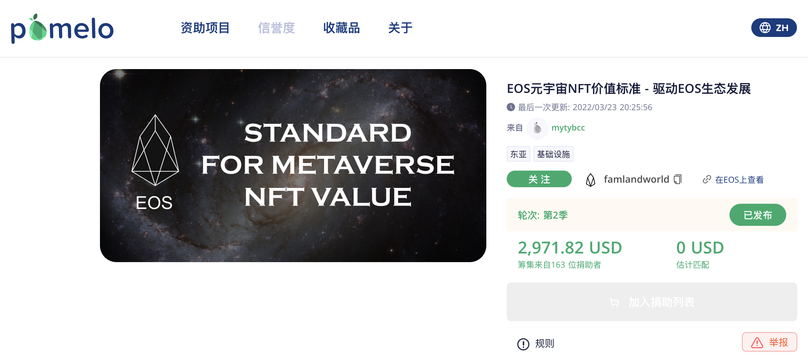

## 在Pomelo上为Famland项目进行捐助匹配扶持基金（第二季进行中）

在第一季募集资金活动期间，，所有社区用户通过自愿捐助打赏方式，为Famland元宇宙项目匹配更多的Pomelo扶持基金.

第二季募集资金活动于2022年3月30日开启，**为期24天，4月23日结束**。呼吁社区伙伴踊跃参与，再次为Famland募集更多资金。（每人认捐1-5个EOS，项目可匹配10-20倍以上的扶持基金）。

 EOS公链在现阶段全球所有公链中，性能最好，门槛最低的平民公链。连续5年在中国国家工信部全球公链排行榜中名列第一。Pomelo基金会，是EOS社区的官方基金会，也是现阶段整个EOS生态中最权威的项目审核机构。

Famland元宇宙项目是中国第三家通过Pomelo审核的EOS公共社区项目，希望通过此次捐助活动，能得到更多国人和社会各界人士的赞助和支持。

## 捐赠入口

**项目支持链接地址：**[https://pomelo.io/grants/eosnftvalue](https://pomelo.io/grants/eosnftvalue)

**Pomelo项目捐款教程指南：**[https://help.eossupport.io/zh-CN/articles/5729024-pomelo](https://help.eossupport.io/zh-CN/articles/5729024-pomelo)

所有参与此次捐助的用户，Famland元宇宙将会永久记录其转账记录，并通过Famland元宇宙官方网站和各社区平台列名致谢。如果Famaland元宇宙NFT价值标准，在日后成为全球NFT价值的通用标准，得到大力推广，未来将会获得更多的受益人的回报。

项目捐助者转账记录：[https://bloks.io/account/famlandworld](https://bloks.io/account/famlandworld)

## 第一季海报

