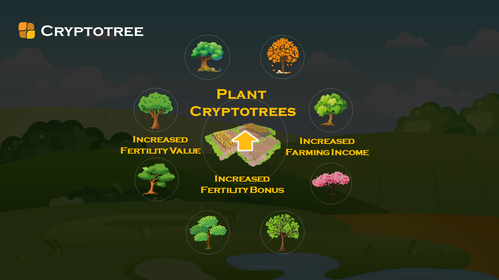

CryptoTree是一款价值养成的NFT，是YLE生态第一代NFT树种，限量发行60万株，可永久产出FF、德星等加密数字资产。玩家付出时间、劳动、人缘和运气，不断改变NFT的基因性能，从而提升NFT的价值。

获得八宝树的渠道

- 渠道一：耕种Famland，将Famland肥力值提升到60000以上。 YLE中领取八宝树，Famland肥力值须提升至60000以上，并且初次领取或先要求完成KYC。按照在基本田投入500USDT满额做市，大约需要45天以上可满足领取栽种八宝树的条件。
- 渠道二：通过NFT交易市场购买获得。
- 渠道三：参与YLE筹备期原始田做市资格认购空投活动免费获得（限时活动）

## 什么是KYC认证？领取CryptoTree为什么需要用到KYC？

 KYC是英文Know Your Customer的简称，这是一种对账户持有人真实性的审查机制，因为要了解资金来源的合法性，是防范洗钱和腐败的制度基础，KYC就像是一个个人档案信息的载入，例如真实姓名、ID号码、手机号码、财产状况等，就像去银行开户，需要填写一大堆的个人资料，这就是在进行KYC。KYC在用户信息管理，财产安全，以及满足政府部门的监管要求，都是十分必要的。

加密数字资产都有去中心化的匿名特性，某种程度上看似乎与KYC相背，但区块链的目标，从来不应该是对抗审查，拒绝政府管制，而是为了让数据更透明，为了解决社会信任问题，是助推社会文明。过去，加密货币的交易中频繁出现诈骗、被盗事故，不法分子利用加密货币进行集资洗钱，贩毒等非法行为，所以在各国政府和监管机构的推动下，KYC已经成为加密货币交易所必须执行的规则，所以用户在注册加密货币交易所时，都会进行KYC认证。KYC是国际金融活动中不可缺少的环节，主要用于防止洗钱、身份盗窃、金融诈骗等犯罪行为，通过KYC认证，确保金融活动参与者真实身份，保护用户隐私。

> 进行KYC有三个重要意义：
>
> 1. 保障社区价值。区块链领域，数字资产流通个环节里都需要实名制，这是大势所趋，通过实名制，选择出社区真正的参与者，避免虚假大数据的产生，必将大幅提升社区的价值。
> 2. 应对监管层面。区块链领域比较混乱，监管部门不会一直漠视不理，必然会制定规则进行监管，CrytoTree社区是合法合规的，为了社区更健康的发展，在需要政府监管时，社区会全力配合。
> 3. 保护个人资产。财产权利必然受法律的约束和规范，同样也受到法律的保护，只有采用实名制，才能保证自身财产不受侵犯。因此，从社区价值、区块链监管、资产保护三个方面来看，选择KYC实名认证是社区健康发展的必经之路。

最后提醒大家，领取CryptoTree八宝树的时候，一个人认证一个钱包账号就可以了，就算开再多的钱包账号，到时候进行KYC实名认证的时候，一个人KYC只能验证一个钱包账号，领取一株CryptoTree，所以开太多钱包账号都是没有意义的。