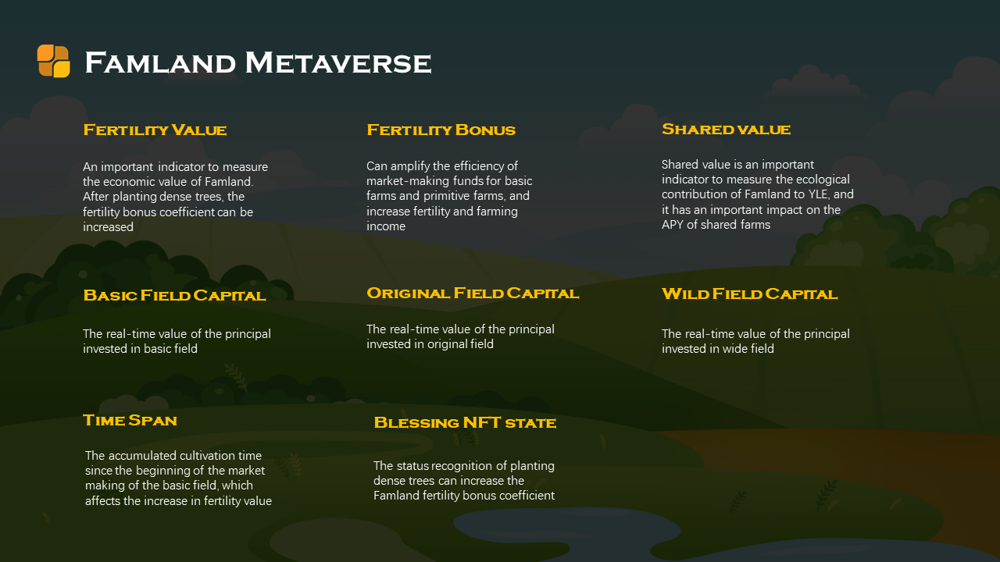
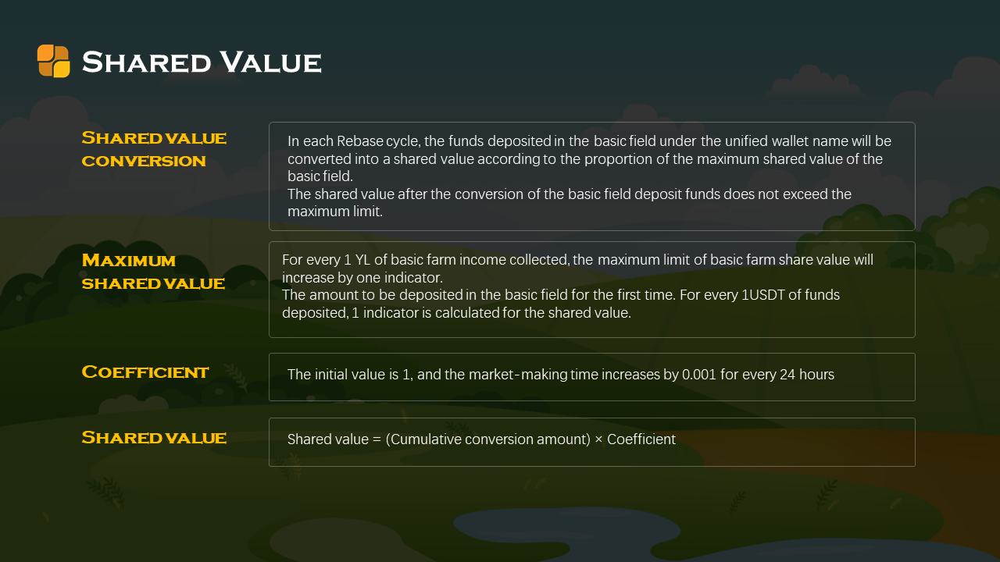

## Basic attributes of famland NFT

| Property                             | Introduction                                                 |
| ------------------------------------ | ------------------------------------------------------------ |
| Number                               | Framland # Number Code                                       |
| LOGO                                 | Standardized cover picture of famland, automatically generated by the system |
| Fertility value                      | After planting crypto trees in YLE farm, the increase in fertility value can be converted into fertility bonus coefficient according to the rules |
| Fertility bonus coefficient          | can amplify the efficiency of market-making capital for basic field and Original field, and increase fertility value and farming income |
| Shared value                         | Shared value is an important indicator to measure the famland’s contribution to YLE ecological |
| Farming time span                    | The accumulated farming time span since the beginning of the market-making of the basic field, which affects the increase in fertility value |
| Basic field market-making capital    | The actual amount of capital invested in the basic field     |
| Original field market-making capital | The actual amount of capital invested in original field      |
| Wild field Market-making capital     | The actual amount of capital invested in the Wild field      |
| Net investment capital               | The net value of capital invested and withdrawn in all field of the famland, the minimum is 0 |
| Market-making value of famland       | Calculate the index of famland farming income                |
| The status of planted crypto tree    | The status of the planted crypto tree is recognized. If the crypto tree has been planted, the fertility value increment can be converted into a fertility bonus coefficient according to the rules. |

## Famland编号

Famland编号的格式为：Famland#数字编码，数字编码从1开始按升序依次递增。

## 肥力值

肥力值的计算规则：

**肥力值=耕种时长×3%×((基本田做市资金+原始田做市资金)×肥力加成系数×3%+净投入资金×0.03%）**

从以上规则得知，影响肥力值最大的权重因素主要是**耕种时长、基本田和原始田做市资金的数额**。由于基本田和原始田做市资金额度都有上限，因此**提升耕种时长**和**提升肥力加成系数**，是提升肥力值的关键。而即便在原始田和基本田做市后，最多也只能获得200%的肥力加成系数，如果想要进一步提升，必须从YLE中获得并栽种加密树，一旦栽种成功，Famland将激活肥力值转化肥力加成系数的通道。

## 肥力加成系数

肥力加成系数有2个重要作用：

其一，加速肥力值的提升和加速肥力加成系数的转化。

其二，放大基本田和原始田做市资金的效能，获得更高的耕种收益。

用户在原始田和基本田做市可直接获得200%的肥力加成系数，栽种加密树后还可获得100%的肥力加成系数。

Famland栽种加密树后，Famland肥力值将按照以下规则转化为肥力加成系数。

**肥力值转化肥力加成系数规则：**

栽种加密树NFT后，肥力加成可以按照0.001为单位进行提升，首次肥力加成提升0.001，肥力值须提升20000，肥力加成再次提升0.001，需提升的肥力值在之前的提升的基础值上提升3‰。

## 耕种时长

用户在Famland基本田地块做市成功后，耕种时长开始按分累计，在基本田取回做市资金，不论取回多少，耕种时长清零重新计算。在基本田增加做市资金或在野田取回做市资金不影响耕种时长。

## 共享值

共享值是衡量Famland对YLE生态贡献度的重要指标，只有基本田才能产生共享值，原始田和野田都不会产生。共享值每个rebase周期计算一次。共享值只增不减，用后无论撤销做市本金或收取收益，都不影响共享值，共享值是对用户曾经付出过的价值共享行为的量化。

**共享值转化额**

每个Rebase周期，将根据用户在名下所有Famland的基本田存入的资金，均可以按照所在Famland基本田的共享值限额占比获得共享值的转化额度。

每个周期共享值转化后的额度，不能超过Famland共享值的上限额度。

**共享值限额**

是指该Famland共享值阶段性的上限额度，由基本田产出的收益决定，用户在基本田收取的收益每增加1YL，共享值限额就增加1。

只有在基本田做市的Famland才有共享值初始限额，共享值初始限额按照首次在基本田投入的资金数额产生，在基本田每存入价值1USDT的资产，共享值初始值增加1个指标。

**共享系数**

共享系数取决于基本田耕种时长，初始系数为1，随后每增加24小时，共享系数增加0.001。如果用户取回基本田做市资金，不论取回多少，共享系数将清零重新累计。

共享值计算规则

**共享值=累计共享值转化额×共享系数**

## Famland做市价值

Famland做市价值是计算Famland耕种收益的指标。

Famland**做市价值=（基本田做市资金+原始田做市资金）×肥力加成系数+野田做市资金**

Famland**每天耕种收益=**Famland**做市价值\*农场年化APY/365**