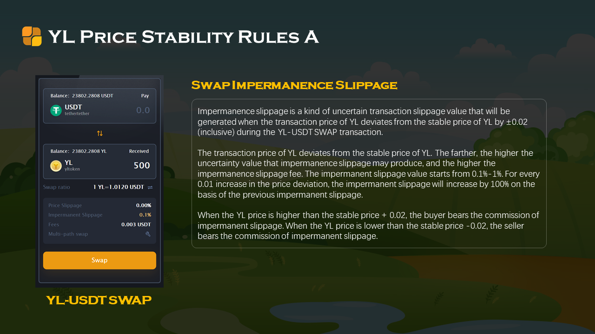

无常滑点，是在SWAP交易过程中，如果YL的交易价格偏离基准价（±0.02含）时，产生的一种不确定的交易滑点值，交易价格偏离基准价格越远，无常滑点可能产生的不确定值就越高，无常滑点手续费就越高。无常滑点值从0.1-1启动，价格偏离每增加0.01，无常滑点都将在前一个无常滑点基础上翻倍。

> 比如，当YL`基准价`为1USDT，市场交易价格为1.02时，买方的正常交易滑点为0.03。而无常滑点显示为0.1-1。可当交易价格为1.05时，正常交易滑点依然是0.03，而无常滑点显示为0.4-4。也就是说，此时交易，产生的最低总滑点可能是0.43，而最高滑点将能达到4.03。如果价格涨到1.06，最高总滑点可能达到8.03。以此类推。

**基准价：**

基准价是SWAP无常滑点机制和稳定池运作的参考指标。从第1纪元第1个耕种周期开始，YL的初始基准价为1USDT，下一个耕种周期将按照上一个周期的YL交易的的中间价作为基准价。

> 例如：第一个周期YL的市场交易价格波动在1.00-1.06USDT之间，交易中间价为1.03USDT，那么，下一个耕种周期的YL的基准价就是1.03USDT。

**无常滑点手续费承担者**

当YL交易价格相对基准价偏高0.02及以上时，买方在交易时承但无常滑点手续费，卖方交易不受影响；反之，当YL交易价格相对基准价偏低0.02及以下时，卖方在交易时承担无常滑点手续费，买方交易不受影响。

**无常滑点值算法规则**

当无常滑点机制启动时，无常滑点值为10%-100%，交易价格偏离基准价格每增加0.01，无常滑点值将在前一个无常滑点基础上翻倍。