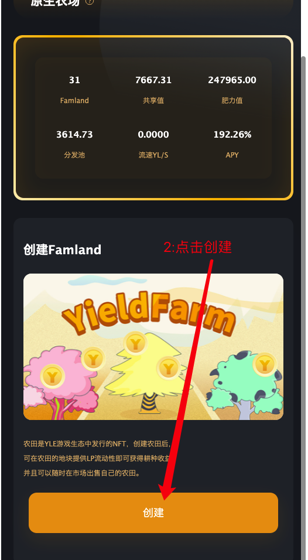
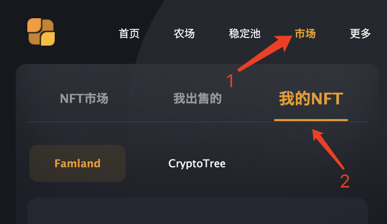

## 获得Famland

用户有以下三种渠道获得Famland：

>**创建新**Famland：Famland是不限量发行的NFT资产，用户可以免费创建Famland的方式获取，新创建的Famland基本没有太大的经济价值，所以用户需要通过长期耕种、合田等操作方式提升其经济价值。

>**购买**Famland：用户可以从YLE World NFT市场中购买其他用户的Famland。购买Famland所需YL，可通过YLE Swap交易用USDT兑换获得。

>**租赁**Famland：对于投入资金有一定困难的玩家，无须做市资金投入，直接租用共享农场农场主公开出租的Famland，租赁人可按照合同的收益分成规则获得耕种收益。

免费创建Famland：钱包准备妥当之后，打开钱包的*发现*，在搜索栏输入Farmland的链接，点击进入dapp,如图

### 第一步：打开dapp，点击农场选择：原生农场

### 第二步：打开原生农场后，下拉至底部然后点击：创建

提示创建成功，表示 已经创建了一块Famland .

⚠️：由于链上数据有延迟，可以在 **“市场-我的NFT”** 栏目下找到刚刚创建的Famland

