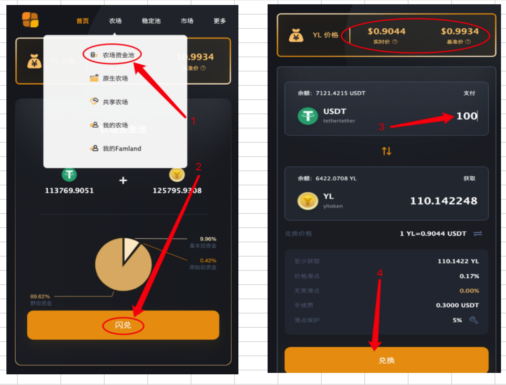
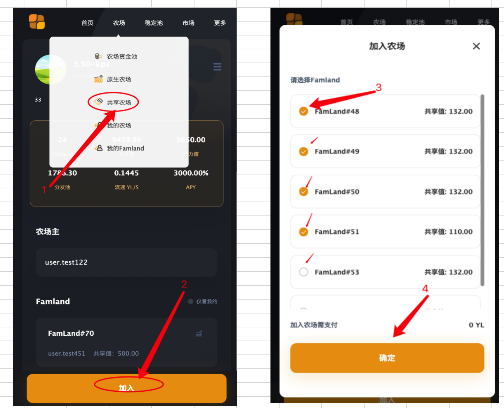

## 一、如何获得划算的YL?

在Famland的首页界面分别显示实时价格和基准价格，当实时价格低于基准价格0.02的实时兑换，不但能够获得便宜的YL，还可以获得激励奖励。如果实时价格高于基本价格0.02时兑换，将承担无常滑点，此时建议等下一个周期再兑换，将不在有无常滑点。

兑换教程如图：

## 二、如何耕种获得高收益？

### 1、认购原始田资格

上线前认购原始资格将，可于项目正式上线前优先进入原始田做市通道进行做市。享受原始田实际投入本金效能放大至少4倍的特别福利，还将按照规则或者赠送的八宝树。上线前可以抢购原始田资格，有但是不享受有赠送八宝树。

### 2、复投

将栽种的YL进行复投，可以配资复投，也可以折半复投，通过复投，获得的收益会呈几何倍数增加。

### 3、栽种八宝树

栽种八宝树的Famland将实现肥力值加成，直接将收益提升30%，因此及时栽种八宝树是很好的选择。

### 4、加入共享农场

共享农场有较高的共识，通过农田耕种者会将共享农场的肥力值提升，从而获得较高的年华，其收益也会相应增加。加入农场时选择肥力值较高的农场，是提高收益的较好选择。加入农场方法，如图：

### 5、年华较高时收取收益。

农场有收益后，不要急于去收取，等年华达到较高时（最高为3000）收取，将获得较多的收益。

